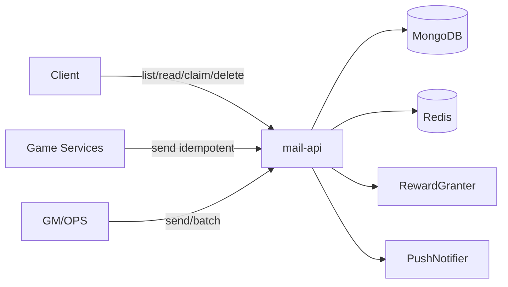

# 游戏邮件模块设计（MongoDB + Redis，可移植）

> 目标：提供一个可在多个游戏项目中直接移植复用的邮件模块，存储基于 MongoDB + Redis，并为横向扩展预留 `serverId` 分区键。

## 1. 规模假设与设计取舍

- DAU：约 2 万；峰值在线：约 1 万
- 广播邮件可能频繁（活动期明显增多）
- 发送/领取需支持幂等
- 不需要多租户（tenant/gameId）能力

**核心取舍**

- **收件箱存储采用"一封邮件一条文档"**：避免单用户邮箱文档膨胀，天然分页与索引。
- **广播采用"母本 + 用户游标 + 拉取时补齐"**：避免频繁广播导致全量 fanout 写放大；活跃用户拉取时才落地为用户邮件。
- **强幂等**贯穿：发送幂等（`scope + dedupKey`）、领取幂等（`idempotencyKey = serverId:uid:mailId`）。
- `serverId` 作为**逻辑区服/世界/分片的数据分区键**：单服固定 `serverId=0`；横向扩展时再按服拆分。

## 2. 模块边界与可插拔依赖（Ports）

邮件模块仅依赖以下端口，方便移植：

```go
package mail

import "context"

// === 核心端口（必须实现） ===

type RewardGranter interface {
	Grant(ctx context.Context, serverID int32, uid int64, items []RewardItem, idempotencyKey string) error
}

type Locker interface {
	WithUserLock(ctx context.Context, serverID int32, uid int64, fn func(context.Context) error) error
}

// === 可选端口（按需实现） ===

type PushNotifier interface {
	NotifyUser(ctx context.Context, serverID int32, uid int64, event string, payload any) error
	NotifyServer(ctx context.Context, serverID int32, event string, payload any) error
}

type TargetResolver interface {
	// Match 必须保证：对同一条 broadcast mail，在游标推进后不会"未来才匹配"。
	// 动态规则请在发送侧固化为 uid_list。
	Match(ctx context.Context, serverID int32, uid int64, target Target) (bool, error)
}
```

> 业务项目落地时，只需实现这些端口，邮件模块的核心逻辑可保持不变。

## 3. 总体架构



> 首版不需要独立 worker 进程。延迟生效、自动领取等后台任务可在 V2 按需引入。

## 4. 标识与关键字段约定

### 4.1 `serverId`

数据分区键（逻辑服/分片），用于隔离不同服数据、支持按服广播。

- 单服：固定 `serverId=0`
- 多服：每次请求都必须显式带 `serverId`

### 4.2 `mailId`

单调递增的邮件 ID（用于排序/游标/去重）。

- 生成方式：`INCR {mail:seq:<serverId>}`（每个 `serverId` 一条序列）
- 延迟生效约束：当 `StartAtMs > now` 时，**不在创建时分配 `mailId`**，应在生效时刻分配，保证 `mailId` 顺序与可投递顺序一致。

### 4.3 幂等键

- 发送幂等：`requestId`（调用方生成；同一 `serverId` 下按 `scope + dedupKey` 去重）
- 领取幂等：`idempotencyKey = <serverId>:<uid>:<mailId>`（用于 RewardGranter 防重）

## 5. MongoDB 设计（集合与索引）

### 5.1 `user_mails`（收件箱）

一封邮件一条文档（个人/广播补齐后统一落地在此）。

| 分类 | 字段 | 说明 |
|------|------|------|
| 分区与归属 | `serverId`, `uid` | |
| 标识 | `mailId` | 递增 |
| 类型 | `kind`（`personal\|broadcast\|notify`）, `source` | |
| 内容 | `templateId`, `params`, `i18nParams` | `templateId=0` 时使用 `title`/`content` 直存 |
| 纯文本 | `title`, `content` | `templateId == 0` 时使用 |
| 附件 | `rewards: [{itemId, count}]` | |
| 时间 | `sendAt`, `expireAt` | |
| 状态 | `readAt`, `claimedAt`, `deletedAt` | null 表示未操作 |
| 清理 | `purgeAt` | TTL 物理删除时间 |
| 溯源 | `origin: {type, id}` | 广播补齐时记录母本 mailId |

**索引**

- `uniq(serverId, uid, mailId)` — 唯一
- `idx(serverId, uid, deletedAt, mailId desc)` — 收件箱分页
- TTL on `purgeAt`（`expireAfterSeconds: 0`）

### 5.2 `broadcast_mails`（广播母本）

广播邮件只存一份，通过用户拉取时的"补齐"落到 `user_mails`。

| 分类 | 字段 |
|------|------|
| 标识 | `serverId`, `mailId`（与 user_mails 同一序列） |
| 目标 | `target`（见第 6 节） |
| 内容/附件/时间 | 同 user_mails |
| 撤回 | `recalledAt`, `recalledBy` |
| 清理 | `purgeAt` |

**索引**

- `uniq(serverId, mailId)`
- `idx(serverId, mailId asc)` — 游标扫描
- TTL on `purgeAt`

### 5.3 `mailbox_meta`（用户游标）

每用户一条记录，记录广播同步游标。

- `serverId`, `uid`, `broadcastCursor`, `updatedAt`
- 索引：`uniq(serverId, uid)`

### 5.4 `mail_dedup`（发送幂等表）

保证同一业务语义下不会重复生成邮件。

- `_id = <serverId>:<scope>:<dedupKey>`
- `serverId`, `scope`, `dedupKey`, `requestId`, `resultMailId`, `createdAt`, `purgeAt`

`scope/dedupKey` 约定：

| scope | dedupKey |
|-------|----------|
| `send_personal` | `requestId` |
| `send_broadcast` | `requestId` |
| `batch_send_personal` | `<requestId>:<uid>` |

索引：`uniq(_id)` + TTL on `purgeAt`

## 6. Redis 设计

> Key 使用 hash-tag（`{...}`）便于 Redis Cluster。

| Key | 用途 |
|-----|------|
| `INCR {mail:seq:<serverId>}` | 生成递增 `mailId` |
| `SET {lock:mail:<serverId>:<uid>} NX PX <ttl>` | 用户锁（领取等写操作） |
| `GET/SET {broadcast:latest:<serverId>}` | 最新广播 `mailId`（补齐快路径） |
| `HINCRBY {mail:unread:<serverId>} <uid> <delta>` | 未读数缓存 |

## 7. 核心业务流程

### 7.1 收件箱拉取（ListInbox）

目标：广播频繁时避免每次拉取都扫描大量广播。

1. 读取 `mailbox_meta.broadcastCursor`
2. 读取 Redis `{broadcast:latest:<serverId>}`，若 `cursor >= latest` 则跳过补齐（**快路径**）
3. 否则从 `broadcast_mails` 扫描 `mailId > cursor`，过滤 `recalledAt == null`，单次最多 200 条
4. 对每条广播做 `TargetResolver.Match(...)`（默认内置 `all/server`）
5. 命中则对 `user_mails` 批量 `upsert`（`$setOnInsert`），依赖唯一索引去重
6. 更新 `broadcastCursor = 连续成功处理区间的末端 mailId`（`$max` 语义，不跨过失败点）
7. 查询 `user_mails` 分页返回：
   - `deletedAt == null && sendAt <= now && expireAt > now`
   - 排序 `mailId desc`，支持 `beforeMailId` 游标分页

**重要约束**

- 广播 `target` 必须是**稳定规则**（不因用户状态变化而"之后才匹配"）。
- 动态条件（等级/战力等）应在发送时固化成 `uid_list`，否则游标推进会漏发。

### 7.2 发送个人邮件（SendPersonal）

1. 写入 `mail_dedup`（重复则返回旧 `resultMailId`）
2. `mailId = INCR {mail:seq:<serverId>}`
3. 插入 `user_mails`
4. 更新未读数、可选推送

### 7.3 发送广播（SendBroadcast）

1. 写入 `mail_dedup(scope=send_broadcast)`（重复则返回旧结果）
2. `mailId = INCR {mail:seq:<serverId>}`
3. 插入 `broadcast_mails`
4. `SET {broadcast:latest:<serverId>} mailId`
5. 可选推送"有新邮件"

> 延迟生效（`StartAtMs > now`）见 V2 扩展。

### 7.4 标记已读（MarkRead）

- 批量更新 `readAt = now`（仅对 `readAt == null` 的记录生效）
- 无需加锁

### 7.5 领取附件（ClaimRewards）

领取是强一致关键路径：**必须防并发、必须幂等**。

1. 获取用户锁 `{lock:mail:<serverId>:<uid>}`
2. 查询待领取邮件，过滤 `sendAt <= now && expireAt > now && claimedAt == null`
3. 对每封邮件调用 `RewardGranter.Grant(idempotencyKey = <serverId>:<uid>:<mailId>)`
4. 发奖成功后更新 `claimedAt=now, readAt=now`
5. **部分失败处理**：已成功的正常标记，失败的不标记 `claimedAt`（允许重试），未处理的继续尝试（不中断批次）
6. 返回每封邮件的领取结果 + 聚合奖励清单

> 若奖励系统失败/超时：不写 `claimedAt`，允许重试；依赖 `idempotencyKey` 防止重复发奖。

### 7.6 删除邮件（DeleteMails）

- 软删：`deletedAt = now`
- 物理清理：依赖 TTL `purgeAt`
- 可按产品规则限制：只允许删除"已读且已领取/无附件"的邮件

### 7.7 获取未读数（GetUnreadCount）

采用 **Redis 缓存 + MongoDB 对账**：

- 写时更新 Redis（`HINCRBY` 增/减未读数），只对实际状态变更的邮件计数
- 读时优先返回 Redis 值
- 登录时或每 N 次 `ListInbox` 做一次对账（以 MongoDB 为准修正）

| 事件 | Redis 操作 |
|------|-----------|
| 新个人邮件写入 | `+1` |
| 广播补齐 N 条 | `+N` |
| MarkRead | `-len(新标已读)` |
| ClaimRewards（含自动标已读） | `-len(新标已读)` |
| DeleteMails（含未读） | `-len(删除的未读)` |

## 8. 广播定向（Target）

### 8.1 内置（首版）

- `all`：全服所有用户
- `server`：指定 `serverId`

### 8.2 预留扩展（通过 TargetResolver 实现）

- `uid_list`：指定 UID 名单（适合补偿，强稳定，游标可安全推进）
- `segment`：按稳定属性筛选（注册时间/渠道/国家/语言等；动态属性应固化成 `uid_list`）

## 9. API 定义

与传输协议无关的抽象 API；HTTP/gRPC 只做薄映射。

### 9.1 数据结构

```go
package mail

type MailKind string

const (
	MailKindPersonal  MailKind = "personal"
	MailKindBroadcast MailKind = "broadcast"
	MailKindNotify    MailKind = "notify"
)

type RewardItem struct {
	ItemID int32
	Count  int64
}

type Mail struct {
	ServerID    int32
	UID         int64
	MailID      int64
	Kind        MailKind
	Source      int8
	TemplateID  int32
	Params      []string
	I18nParams  any
	Title       string // templateId == 0 时使用
	Content     string // templateId == 0 时使用
	Rewards     []RewardItem
	SendAtMs    int64
	ExpireAtMs  int64
	ReadAtMs    int64 // 0 = 未读
	ClaimedAtMs int64 // 0 = 未领取
	DeletedAtMs int64 // 0 = 未删除
}

type Target struct {
	Scope string // all/server/uid_list/segment
	Data  any
}
```

### 9.2 Service 接口

```go
type Service interface {
	// === 玩家 API ===
	ListInbox(ctx context.Context, req ListInboxRequest) (ListInboxResponse, error)
	MarkRead(ctx context.Context, req MarkReadRequest) (MarkReadResponse, error)
	ClaimRewards(ctx context.Context, req ClaimRewardsRequest) (ClaimRewardsResponse, error)
	DeleteMails(ctx context.Context, req DeleteMailsRequest) (DeleteMailsResponse, error)
	GetUnreadCount(ctx context.Context, req GetUnreadCountRequest) (GetUnreadCountResponse, error)

	// === 业务/内部 API ===
	SendPersonal(ctx context.Context, req SendPersonalRequest) (SendResponse, error)
	SendBroadcast(ctx context.Context, req SendBroadcastRequest) (SendResponse, error)
}

type AdminService interface {
	RecallBroadcast(ctx context.Context, req RecallBroadcastRequest) error
	BatchSendPersonal(ctx context.Context, req BatchSendPersonalRequest) (BatchSendPersonalResponse, error)
	QueryByRequestId(ctx context.Context, req QueryByRequestIdRequest) (QueryByRequestIdResponse, error)
	GetBroadcastStats(ctx context.Context, req GetBroadcastStatsRequest) (GetBroadcastStatsResponse, error)
}
```

### 9.3 请求/响应定义

```go
// ---- 玩家 API ----

type ListInboxRequest struct {
	ServerID     int32
	UID          int64
	BeforeMailID int64 // 分页游标；0 = 从最新开始
	Limit        int32 // 默认 50，上限 100
}

type ListInboxResponse struct {
	Mails      []Mail
	NextCursor int64 // 下一页游标，0 = 没有更多
}

type MarkReadRequest struct {
	ServerID int32
	UID      int64
	MailIDs  []int64
	All      bool
}

type MarkReadResponse struct {
	UpdatedMailIDs []int64
}

type ClaimRewardsRequest struct {
	ServerID int32
	UID      int64
	MailIDs  []int64
	All      bool
}

type ClaimResult struct {
	MailID  int64
	Success bool
	Code    ErrCode
	ErrMsg  string
}

type ClaimRewardsResponse struct {
	Results        []ClaimResult
	ClaimedMailIDs []int64
	FailedMailIDs  []int64
	Rewards        []RewardItem // 成功部分的聚合奖励
}

type DeleteMailsRequest struct {
	ServerID int32
	UID      int64
	MailIDs  []int64
	All      bool
}

type DeleteMailsResponse struct {
	DeletedMailIDs []int64
}

type GetUnreadCountRequest struct {
	ServerID int32
	UID      int64
}

type GetUnreadCountResponse struct {
	UnreadCount  int64
	HasClaimable bool // 是否有可领取附件
}

// ---- 业务/内部 API ----

type SendPersonalRequest struct {
	ServerID  int32
	RequestID string // 必填：发送幂等
	UID       int64
	Kind      MailKind
	Source    int8
	TemplateID int32
	Params     []string
	I18nParams any
	Title      string       // templateId == 0 时使用
	Content    string       // templateId == 0 时使用
	Rewards    []RewardItem
	SendAtMs   int64 // 0 = 立即
	ExpireAtMs int64 // 0 = 默认 15 天
}

type SendBroadcastRequest struct {
	ServerID  int32
	RequestID string // 必填：发送幂等
	Target    Target
	Kind      MailKind
	Source    int8
	TemplateID int32
	Params     []string
	I18nParams any
	Title      string
	Content    string
	Rewards    []RewardItem
	StartAtMs  int64 // 0 = 立即生效
	ExpireAtMs int64
}

type SendResponse struct {
	MailID int64
}

// ---- Admin/GM API ----

type RecallBroadcastRequest struct {
	ServerID int32
	MailID   int64
	Operator string
	Reason   string
}

type BatchSendPersonalRequest struct {
	ServerID  int32
	RequestID string // 批次幂等 ID
	UIDs      []int64
	Kind      MailKind
	Source    int8
	TemplateID int32
	Params     []string
	I18nParams any
	Title      string
	Content    string
	Rewards    []RewardItem
	SendAtMs   int64
	ExpireAtMs int64
}

type BatchSendResult struct {
	UID    int64
	MailID int64
	Err    string
}

type BatchSendPersonalResponse struct {
	Results      []BatchSendResult
	SuccessCount int32
	FailCount    int32
}

type QueryByRequestIdRequest struct {
	ServerID  int32
	Scope     string // send_personal/send_broadcast/batch_send_personal
	RequestID string
	UID       int64 // batch_send_personal 时必填
}

type QueryByRequestIdResponse struct {
	Found    bool
	Status   string // not_found | pending | done
	Scope    string
	MailID   int64
	MailKind MailKind
}

type GetBroadcastStatsRequest struct {
	ServerID int32
	MailID   int64
}

type GetBroadcastStatsResponse struct {
	TotalDelivered int64
	TotalRead      int64
	TotalClaimed   int64
	TotalDeleted   int64
}
```

## 10. 并发安全

### 10.1 广播补齐

依赖 `uniq(serverId, uid, mailId)` 唯一索引天然去重，**无需额外加锁**。

- 并发 upsert 用 `$setOnInsert`，后到的为 no-op
- `broadcastCursor` 用 `$max` 更新（只往前推，不回退）

### 10.2 MarkRead vs ClaimRewards

- `ClaimRewards` 内部会自动设置 `readAt`
- 两者都用 `$set readAt = now WHERE readAt == null`，幂等安全
- **无需加锁**

### 10.3 ClaimRewards 并发控制

- **必须加用户锁**（`Locker.WithUserLock`），粒度 `serverId + uid`
- 即使锁失效，`RewardGranter` 的 `idempotencyKey` 作为最后防线

### 10.4 SendPersonal 并发控制

- **不需要用户锁**
- 依赖 `mail_dedup` 唯一索引保证幂等
- 写入流程：先写 `mail_dedup`（成功则继续），再写 `user_mails`

## 11. GM/运营操作

### 11.1 设计原则

- GM 操作走独立的 `AdminService` 接口，与玩家 API 分离
- 所有 GM 写操作记录审计日志（who/when/what）
- 撤回是"尽力而为"的，已领取的奖励不自动回收

### 11.2 撤回广播（RecallBroadcast）

1. 在 `broadcast_mails` 标记 `recalledAt = now, recalledBy = operator`
2. 用户下次 `ListInbox` 补齐时跳过 `recalledAt != null` 的记录
3. 已落地到 `user_mails` 的：异步扫描 `origin.id = mailId && claimedAt == null`，软删
4. 已领取的不撤回

### 11.3 批量发送个人邮件（BatchSendPersonal）

- 内部循环调用 `SendPersonal`，每条通过 `mail_dedup(scope=batch_send_personal, dedupKey=<requestId>:<uid>)` 独立幂等
- 支持部分成功
- 单批次上限 500

### 11.4 按 requestId 查询（QueryByRequestId）

- 查 `mail_dedup` 获取 `resultMailId`，再查对应邮件集合
- `batch_send_personal` 时需同时传 `uid`

### 11.5 广播统计（GetBroadcastStats）

- 基于 `user_mails` 按 `origin.id` 聚合查询（非实时）
- `TotalDelivered` 只统计已补齐的用户

## 12. 过期与清理

- **过期邮件不再展示**：`ListInbox` 过滤 `expireAt > now`
- **过期即视为放弃**：`ClaimRewards` 返回 `ErrMailExpired`
- **过期时间默认计算**：`expireAt = sendAt + 15天`（可由 `ExpireAtMs` 覆盖）
- **物理清理**：`purgeAt = expireAt + 7天`，由 MongoDB TTL 索引自动删除
- **收件箱截断**：`ListInbox` 最多返回 200 条（超出的老邮件自然不可见）

## 13. 错误码

```go
type ErrCode int32

const (
	ErrOK              ErrCode = 0
	ErrInvalidParam    ErrCode = 1001
	ErrMailNotFound    ErrCode = 1002
	ErrMailExpired     ErrCode = 1003
	ErrAlreadyClaimed  ErrCode = 1004
	ErrNoRewards       ErrCode = 1005
	ErrLockFailed      ErrCode = 1006
	ErrRewardGrantFail ErrCode = 1007
	ErrDuplicate       ErrCode = 1008 // requestId 重复（幂等命中，非错误）
	ErrMailNotActive   ErrCode = 1011 // sendAt > now
	ErrInternal        ErrCode = 9999
)
```

## 14. 语义约束

实现时必须遵守：

1. `ListInbox` 默认做广播补齐，单次最多补齐 200 条
2. 发送幂等：相同 `scope + dedupKey` 返回相同结果（在 `mail_dedup` TTL 内）
3. 领取幂等：同一封邮件的同一用户，奖励发放必须可重试不重复
4. 可见性：`sendAt > now` 的邮件不可见、不可领取
5. 广播 target 必须稳定，动态条件必须固化名单
6. 广播补齐失败时，`broadcastCursor` 不跨过失败点（下次从失败点继续）
7. 批量 upsert 使用 `ordered: false`（单条失败不影响其他条目）
8. 所有玩家 API 必须校验 `uid` 与认证用户一致，`serverId` 与所属服一致

## 15. 默认配置

```go
type MailConfig struct {
	DefaultPageLimit       int32 // 50
	MaxPageLimit           int32 // 100
	BroadcastSyncBatchSize int32 // 200
	DefaultMailTTLMs       int64 // 15 天 = 1_296_000_000
	PurgeGraceMs           int64 // 7 天 = 604_800_000
	MaxVisibleMails        int32 // 200
	UserLockTTLMs          int64 // 5000（5 秒）
	MaxRewardsPerMail      int32 // 20
	MaxBatchSendSize       int32 // 500
	MaxClaimBatchSize      int32 // 50
	MaxDeleteBatchSize     int32 // 50
	UnreadReconcileInterval int32 // 每 N 次 ListInbox 对账一次，默认 10
}
```

---

# V2 扩展规划

> 以下功能首版不实现，在 V1 稳定运行后按需引入。本节仅记录设计方向，不作为首版实现范围。

## E1. 延迟生效邮件（SendAt/StartAt）

**场景**：运营预定某时间点发送邮件。

**方案**：引入定时扫描，不分配 `mailId` 直到生效时刻。

- 发送时 `StartAtMs > now`：不分配 `mailId`，将发送参数写入待激活记录
- 定时任务扫描 `startAt <= now` 的待激活记录，执行正常发送流程
- 通过 `mail_dedup` 保证幂等（重复激活返回旧 `resultMailId`）
- 简单实现：定时任务每 30 秒扫描一次 `broadcast_mails WHERE mailId = 0 AND startAt <= now`

> 规模增大后可引入独立 `mail_activation_tasks` 集合，支持 lease/退避/死信。

## E2. 自动领取

**场景**：过期前自动为玩家领取附件。

- worker 定期扫描 `expireAt < now + grace && claimedAt == null && rewards 非空`
- 调用 `RewardGranter.Grant`（幂等），成功后标记 `claimedAt`
- 需要配置开关 `ExpiryPolicy`（默认 `Abandon`，启用后为 `AutoClaimBeforeExpiry`）

## E3. Redis 降级

**场景**：Redis 故障时保证核心流程可用。

| 功能 | 降级方案 |
|------|---------|
| `mailId` 生成 | MongoDB `findAndModify` 原子自增（`mail_sequences` 集合） |
| 用户锁 | MongoDB advisory lock |
| `broadcast:latest` | 每次查 `broadcast_mails` 的 `max(mailId)` |
| 未读数 | 直接查 MongoDB 聚合 |

> Redis 恢复后需将序列值同步到 `max(redisSeq, mongoSeq, maxMailId)` 再切回。

## E4. 监控与告警

**核心指标（建议首先埋点）**：

| Metric | 类型 | 说明 |
|--------|------|------|
| `mail_sent_total` | Counter | 发送总数 |
| `mail_claimed_total` | Counter | 领取成功总数 |
| `mail_claim_reward_fail_total` | Counter | 发奖失败次数 |
| `mail_list_inbox_duration_ms` | Histogram | ListInbox 耗时 |

**告警建议**：

- 发奖失败率 > 5%（5分钟窗口）→ P1
- ListInbox p99 > 500ms → P2

## E5. 接口限流

在 2 万 DAU 规模下，由网关层做粗粒度限流即可。规模增大后可引入模块内限流：

```go
type RateLimiter interface {
	Allow(ctx context.Context, key string, limit int, windowMs int64) (bool, error)
}
```

## E6. 收件箱容量自动清理

首版依赖 `MaxVisibleMails` 查询截断 + TTL `purgeAt` 物理清理。规模增大后可引入主动清理：

- 清理优先级：已读已领取 > 已过期 > 无附件通知 > 有附件过期
- 触发方式：`ListInbox` 检测超限后异步触发，或 worker 定期扫描

## E7. Schema 版本化与迁移

首版所有文档预留 `_v: 1` 字段。需要迁移时再建立迁移框架：

- 新增字段用默认值兼容（读时补零值）
- 字段类型变更不允许，必须新增字段替代
- 大表迁移游标分批处理

## E8. 审计日志

GM 操作审计可写入独立集合 `mail_audit_logs`（带 TTL 90 天），或接入项目已有审计系统。

```go
type AuditEntry struct {
	Timestamp int64
	ServerID  int32
	Action    string // send_personal, recall, batch_send, etc.
	Operator  string
	MailIDs   []int64
	RequestID string
	Detail    any
}
```
